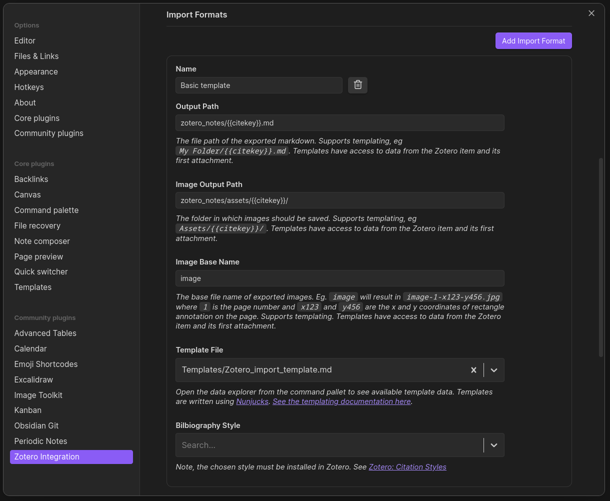

# Obsidian-Zotero workflow

This repository outlines the setup process for utilizing Obsidian in conjunction with Zotero for scientific research, primarily tailored for a Linux distribution, particularly Fedora, which reflects my personal setup.


## Workflow description

Most research processes can be decomposed in three main steps:
1) Reading scientific articles and annotating them
2) Formatting those notes in a more detailed manner, organizing citations
3) Creating drafts and idea notes, directly linking to the literature to use as reference when writing an article

This workflow separates the tasks as follow:
* Steps 1. and 2. are handled in directly in Zotero, using its default tools.
* Step 3. is managed in Obsidian

The key is to link Zotero and Obsidian. This repository serves as guide to facilitate this process, especially on a Linux distribution. 

## Visual presentation
1) I read articles in Zotero, taking notes by highlighting and annotating.


2) I import the notes into Obsidian using a specific template, transferring annotations as Obsidian notes.


An important thing to note is that you can also jump directly from Obsidian to Zotero if your installation is performed correctly. A working installation took some time out of me, hence this repository: simplify this installation process, as well as showcase Obsidian's capabilities.

3) I can reference these notes or specific paragraphs in my Obsidian files for developing ideas, daily notes, or TODOs. Those references work as it would for any other obsidian file.

One neat thing is that you can also import aliases in the note, which means that when trying to reference a Zotero Item, any attribute of the item can be used to find the corresponding note, such as title, author name, citation key.... You only need to set it up correctly


4) Notes can be displayed in Canvas or Excalidraw views to organize literature.


5) Changes in Zotero notes can be easily re-imported into Obsidian for dynamic updates.

6) Finally, all the different types of notes can be identified directly in the graph view, which also allows to group them together.


## Installation
Because of Linux's features, some problems can be found when linking Zotero to Obsidian. In particular, installations using `snap` or `flatpack`, which are the main installations packages for both of these applications. This is due to their containment policies, forbidding obsidian from detecting Zotero.

### Zotero Installation
1) Go to the [official release page](https://www.zotero.org/download/). This should provide you with the latest version in a compressed folder. You can then follow their [installation guide](https://www.zotero.org/support/installation) for your system. You may also want to install the Zotero connector on your browser, since it is a very powerful tool.

2) Install the `better-bibtex` extension by importing the `.xpi` file in Zotero under `Tools > Add-ons > Install add-on from file`.
<!-- TODO: complete this part -->

### Obsidian Installation
Two ways to install obsidian are available. Go to their [official download page](https://obsidian.md/download). From there, you can either:
* Use the `.deb` file (not natively supported on Fedora to my knowledge)
* Use the `AppImage` installation 
    * For the AppImage version, the simplest way to then have Obsidian readily available is to use AppImageLauncher. For this, go to the [official release page](https://github.com/TheAssassin/AppImageLauncher/releases) and install AppImageLauncher, using either the `.rpm` or the `.deb` file. This should prompt you when launching the Obsidian `AppImage` file, installing it on your system globally.

Either case, Obsidian should be installed, you can try to launch it and create a vault to try.

### Setting up Zotero Integration
1) Install the `Zotero Integration` plugin from obsidian under `Community plugins > Browse`.

2) Once it is installed, you need to use a template to import your notes. My personal template file can be found in this repository under `Templates/Zotero_import_template.md` 
    * Templating for `Zotero-Integration` works using `nunjucks`
You should also look at the [package's documentation](https://github.com/mgmeyers/obsidian-zotero-integration/blob/main/docs/Templating.md) if you want to set up your own template. 

    * The template used here is a manually modified version of this [templating repo](https://github.com/nocona71/obsidian-literature-note/blob/main/README.md). You can also use their basic version and fine-tune it to the shape you prefer.

To copy the templates, if you want to synchronize with this git repository for further update, you should perform the following command:
```bash
ln /path/to/this/repo/Templates/* /path/to/your/obsidian/vault/Templates/
```
Otherwise, you can simply copy the file and then modify it as you see fit.

3) Set up Obsidian to use this template to import your Zotero notes. Go to the plugin option, and look for `Import Formats`. You need to create an item and set up the directories you want those notes to be located at in your vault. The result should roughly look like this:
 
One important thing is to use the `{{citekey}}` expression at some point: this is the name of the file, and it must be unique for each item. Other attributes could be used, but it should not matter to much.


Once this is done, you can call the command palette (`ctrl + P`), and type the name you gave your template (for this example, `Basic Template`). This should bring up a Zotero prompt, in which you can type the name of the item you want to import. Alternatively, there is a scrolling menu, in which you can find an option to import multiple items at once in "Classic View". What I often do (when I modify my template for instance) is re-import my entire Zotero collection via this menu in a few clicks.  


<!-- TODO: explain how to set up the template inside obsidian with screenshots -->

## Organization with Periodic Notes and Tasks
You can also organize your notes using two useful plugins: `Periodic Notes` and `Tasks`. The first one is simply a generalization of obsidian's daily notes, allowing to have daily, weekly and/or monthly notes. The second one is a great way to organize your progress. An example of queries one can do (and that I personnally use) is the file `TODO-list.md`. I usually pin this file in obsidian, so that it is always at the same place in all my navigations, even after closing and re-opening obsidian.

To use `Tasks`, I recommand following their configuration advices. The tag I use is `#task`. I also recommand mapping the `Tasks: Toggle task done` command to the same shortcut as `Toggle checkbox status` (default `Ctrl + L`) if you use it, as it will override the ticking correctly - complete a task if it is a task, otherwise simply  

Periodic notes can be generated using a template directly, with syntax based on Nunjucks (see the `daily_notes.md` and `weekly_notes.md` files under `Templates/`). The templates in this repository are also designed to create queries for the tasks that are scheduled or due on the current day or week, which is a great way to automatically generate a plan for the day. Feel free to remove the task queries if you do not want to use this plugin, but still want daily notes. 

Finally, if you obtain on organisation that can be seen on the image below. Notice where the calendar is placed: you can directly click on days to go to a daily/weekly note at all times, or generate it from the template automatically if it does not exist yet.

(*This screenshot uses the PLN theme, which I switched to recently. Go to `parameters>Appearance>Themes` to find it, or any other theme you like*)

Some of these plugins or templates come with tweaks that I do in the CSS styling for better visual results, see the `snippets` folder for more details. You can simply copy the files into your `.obsidian/snippets/` folder if you want to use those snippets (or if you pulled the git, use `ln` to be able to pull future updates). Remember these snippets must be activated in the parameters `Appearance>CSS snippets`

## List of recommended Obsidian packages
This is the list of packages I personally use in obsidian, sorted by order of importance.

* `Tasks`: Very practical plugin to organize tasks, so that todo items are not scattered everywhere in your vault.
* `Image Toolkit`: This plugin allows you to zoom in on an image by clicking it, instead of having to open the image inside Zotero. A must-have if you integrate images in your notes.
* `Excalidraw`: This is one of the most popular plugin on obsidian, it provides enhanced functionality compared to the basic Obsidian canvas feature, allowing you to organize your notes neatly. The plugin itself links to short presentation videos, making it easy to master.
* `Periodic Notes`: This plugin generalizes the concept of obsidian's daily notes, and allows you to create weekly or monthly notes. This can also use a template, albeit much simpler. Some basic example templates are available under `Templates/`
* `Calendar`: This plugin is a good synergy with `Periodic Notes`, as it allows to visualize the month in a calendar and to simply access the daily or weekly notes of a given day or week. 
* `KanBan`: This plugin allows for a very neat TODO items visualization, used in a screenshot above. 
* `Advanced Tables`: A neat table edition toolbar that is lacking in Obsidian, making editing big table less painful. If you plan to use tables, I definitely recommend you take a look. This plugin may be less necessary since a recent obsidian update on tables.
* `Emoji-Shortcode`: This plugin lets the user type emojis as they would in Discord, which is very convenient for me. 


### TODOS:
* [ ] Add a section for Periodic notes set-up, in particular the dating scheme.
* [ ] Detail the CSS files necessary for some plugins.
* [ ] Presentation of an item attributes (such as Zotero notes) and how it makes it easy to cite them
